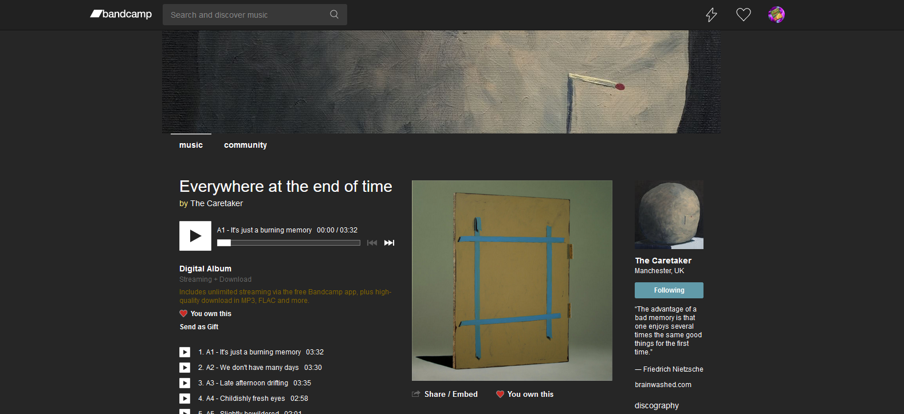

# Bandcamp Dark

A simple dark theme for [Bandcamp](https://bandcamp.com) based on the original work by [aricley](https://userstyles.org/styles/150014/bandcamp-dark-theme-17-10).

---

## Installation

  1. A browser add-on is needed to install custom UserStyles.
  I recommend [Stylus](https://github.com/openstyles/stylus), which is available for both [Firefox](https://addons.mozilla.org/en-US/firefox/addon/styl-us/) and [Chrome](https://chrome.google.com/webstore/detail/stylus/clngdbkpkpeebahjckkjfobafhncgmne?hl).

  2. ### [INSTALL THEME](https://raw.githubusercontent.com/jasuthemes/userstyles/master/BandcampDark/BandcampDark.user.css)
  
---

## Changelog

16/10/19 - Initial Release

03/11/19 - Fixed some Wordpress elements. This will mostly affect Bandcamp Daily.

07/12/19 - Fixed some more Bandcamp Daily Elements.

09/02/20 - Bandcamp logo now white instead of grey.

09/04/20 - Feed and collection icons on menubar now white.

21/04/20 - Minor elements adjusted to fit theme.

26/04/20 - Fixed some minor elements when browsing tags.

01/05/20 - Updated some elements related to Bandcamp Weekly.

05/06/20 - Fixed some updated elements on the tag hub.

12/07/20 - Cleaned the code slightly. Still needs plenty of work. First git commit

26/07/20 - Fixed a couple of elements on the feed page.
